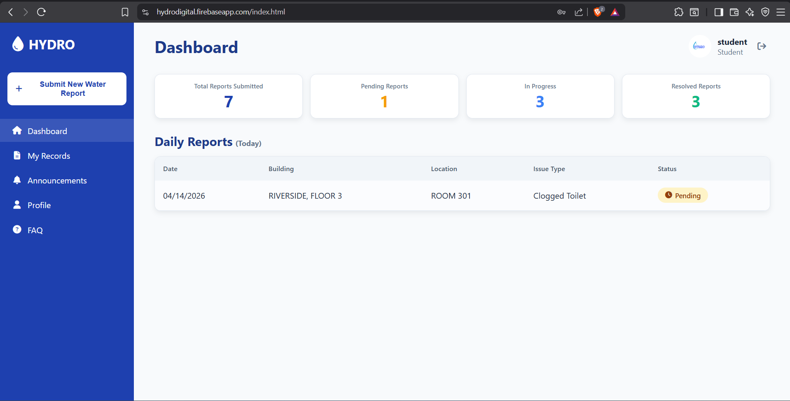
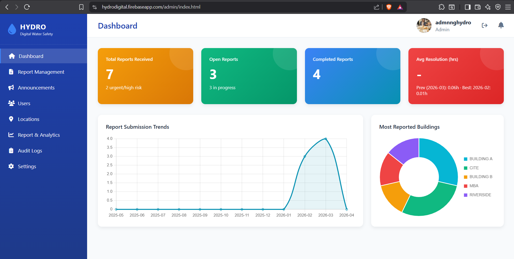
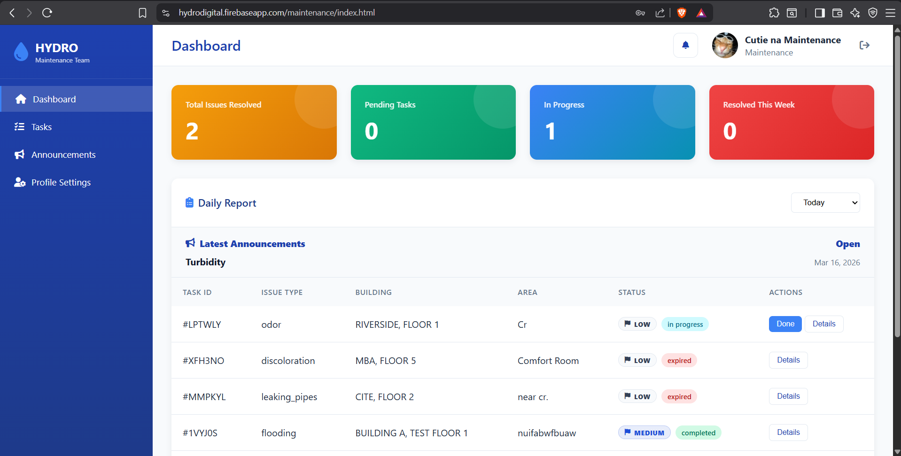
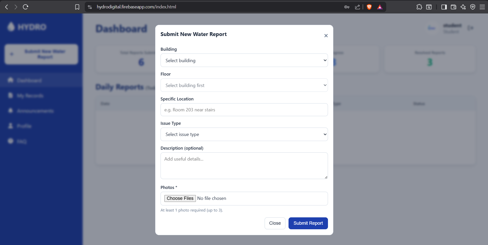

# HYDRO – Incident Reporting & Task Management System

A role-based web application where:
- Users submit incident reports
- Admins review and assign tasks
- Maintenance staff complete and update work

Built using Firebase (Auth, Firestore, Cloud Functions, Hosting).

---

## Quick Flow

1. User submits report  
2. Admin reviews and assigns task  
3. Maintenance completes work  
4. System updates report status  

---

## Live Demo

https://hydrodigital.firebaseapp.com  

> Note: System requires authenticated access. Demo access available upon request.

---

## Screenshots

### Student Dashboard
View submitted reports, track status, and access announcements.



---

### Admin Dashboard
Monitor reports, view analytics, and manage system operations.



---

### Maintenance Dashboard
View assigned tasks, track progress, and update work status.



---

### Report Submission
Submit a new water incident report with location, issue type, and additional details.



---

## Documentation

Detailed documentation is available in the `/docs` folder:
- System overview
- Setup and deployment guide
- Technical documentation

---

# HYDRO

HYDRO is a Firebase-based campus water issue reporting system with separate experiences for students, administrators, maintenance staff, and super admins. The application is built as a static web frontend on Firebase Hosting with Cloud Functions handling privileged workflows such as assignment, user provisioning, announcements, and bootstrap operations.

This public repository uses placeholder Firebase configuration values. Replace the template values and follow the setup guide before deployment.

---

## Overview

HYDRO helps a campus operations team move a report from submission to resolution in one system.

- Students submit incident reports with location and issue details
- Admins review reports, assign tasks, and manage operations
- Maintenance staff complete assigned work and update status
- Super admins manage system configuration and roles

---

## Key Features

- Role-based dashboards (`student`, `maintenance`, `admin`, `super_admin`)
- Report submission with structured location and issue data
- Admin workflow for report triage and task assignment
- Maintenance task lifecycle tracking
- Announcement system with audience targeting
- User management (invite, activate, archive)
- Audit logging for system activity
- Analytics dashboards for reports and performance
- Security features (App Check, rate limiting, login protection)
- First-run bootstrap system for admin setup

---

## Tech Stack

- **Frontend:** HTML, CSS, JavaScript (modular)
- **Backend:** Firebase Cloud Functions (Node.js 20)
- **Database:** Cloud Firestore
- **Storage:** Firebase Storage
- **Auth:** Firebase Authentication (with MFA support)
- **Hosting:** Firebase Hosting
- **Build:** esbuild

---

## Project Structure

```
.
├── public/        # Frontend source
├── functions/     # Backend logic
├── scripts/       # Build scripts
├── dist/          # Deployment output
├── docs/          # Documentation
├── firebase.json
├── firestore.rules
└── storage.rules
```

---

## Setup

See full setup guide:

docs/setup-and-deployment.md

---

## Why I Built This

I built HYDRO to simulate a real-world incident management system with role-based workflows. The goal was to understand how reports move from submission to resolution, including admin review, task assignment, and maintenance execution.

This project helped me learn system design, Firebase backend integration, and security practices such as access control, validation, and structured workflows.

---

## Project Status

HYDRO currently supports a full workflow from report submission to resolution, including admin management, maintenance execution, announcements, analytics, and user management.

---

## Future Improvements

- Add automated tests
- Implement CI/CD pipeline
- Improve dashboard chart handling
